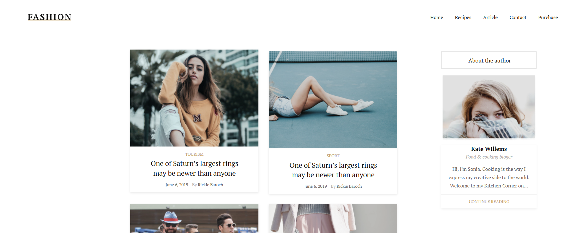

<h1 align="center">Привет, меня зовут Деля!

</h1>
<h2 align="center">Я фронтенд разработчик из России.</h2>

<h2>Это мое портфолио проектов по созданию сайтов:</h2>
<ol>
   <li>
      <h3>Fashion blog</h3>
      

      <strong>Ссылка на проект:</strong> <a href="https://github.com/Renadellaa/fashion-blog.github.io">Fashion blog</a> 
      <strong>Ссылка на сайт:</strong> <a href="https://renadellaa.github.io/fashion-blog.github.io/">Fashion blog</a> 
      <strong>Описание:</strong> Fashion - это адаптивный одностраничный сайт, посвященный тематике фэшн блога, с постами и с применением нативных технологий (HTML5, CSS3) и Pixel Perfect верстки. Проект создавался на основе макета из Figma. 
      <strong>Этапы проекта:</strong>
      <ol type="1">
         <li>Анализ макета.</li>
         <li>Pixel Perfect верстка.</li>
         <li>Адаптивная верстка для экранов разной ширины.</li>
      </ol>
      
      

   </li>
   <li>
      <h3>Castaway</h3>
      

      <strong>Ссылка на проект:</strong> <a href="https://github.com/Renadellaa/castaway.github.io">Castaway</a> 
      <strong>Ссылка на сайт:</strong> <a href="https://renadellaa.github.io/castaway.github.io/">Castaway</a> 
      <strong>Описание:</strong> Castaway - это одностраничный сайт для просмотра и прослушивания подкастов с формой подписки на обновления - с применением нативных технологий (HTML5, CSS3) и Pixel Perfect верстки. Проект создавался на основе макета из Figma. 
      <strong>Этапы проекта:</strong>
         <ol type="1">
            <li>Анализ макета.</li>
            <li>Pixel Perfect верстка.</li>
            <li>Использование Grid Layout в разделе комментариев.</li>
            <li>Использование полей для ввода имени и электронной почты в разделе подписки на обновления.</li>
         </ol> 
       
      
      

   </li>
</ol>
<h2>Языки и инструменты:</h2>

  
  
  
  

<h2>Контакты</h2>
<ul>
   <li>
      Telegram: <a href="https://t.me/renadellaa">Delia Boldyreva</a>
   </li>
   <li>
      E-mail: <a href="mailto:delya.boldyreva.95@mail.ru">Delia Boldyreva</a>
   </li>
</ul>

<a href="https://git.io/typing-svg">

