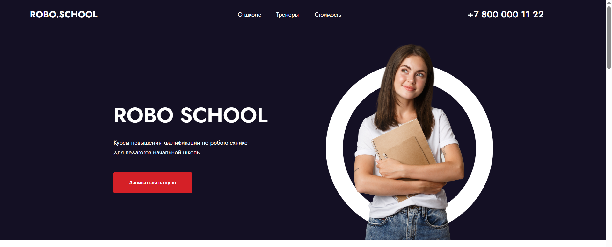
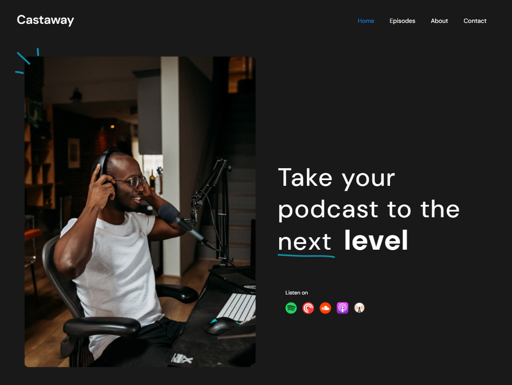
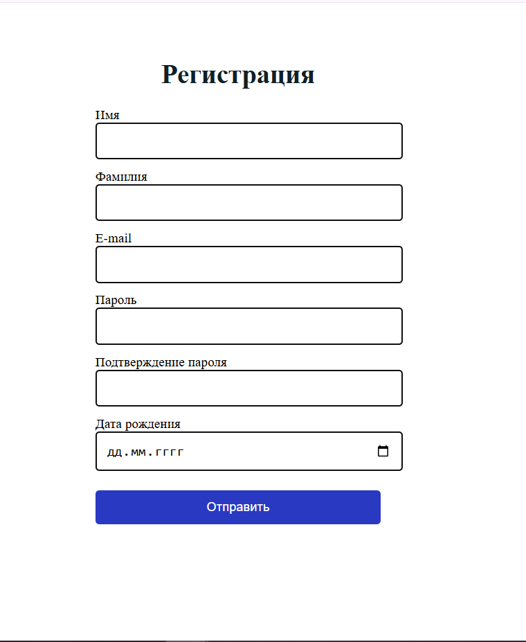

<h1 align="center">Привет, меня зовут Деля!

</h1>
<h2 align="center">Я BI-аналитик.</h2>

<h2>Это мое портфолио проектов по BI-аналитике:</h2>
<ol>
   <li>
      <h3>Adventure Works</h3>
      

      <strong>Ссылка на проект:</strong> <a href="https://github.com/Renadellaa/Adventure_Works_Dashboard">Adventure Works</a> 
      <strong>Описание:</strong> Adventure Works - дашборд, предназначенный для комплексного анализа деятельности компании, позволяя руководству и менеджерам отслеживать ключевые показатели эффективности, сравнивать региональные результаты, анализировать тренды по продуктам и выявлять ценных клиентов. Он состоит из четырёх основных страниц, каждая из которых выполняет важные функции для принятия стратегических решений. 
      <strong>Этапы проекта:</strong>
      <ol type="1">
         <li>Постановка целей и требований.</li>
         <li>Сбор и подготовка данных.</li>
         <li>Трансформация данных.</li>
         <li>Проектирование структуры дашборда.</li>
         <li>Построение дашборда.</li>
         <li>Тестирование и финальная проверка.</li>
      </ol>
      
      

   </li>
   <li>
      <h3>Product Sales Dashboard</h3>
      

      <strong>Ссылка на проект:</strong> <a href="https://github.com/Renadellaa/Sales_Dashboard">Product Sales Dashboard</a> 
      <strong>Описание:</strong>Product Sales Dashboard - дашборд, предназначенный для мониторинга ключевых бизнес-показателей компании, которая занимается продажей оборудования для оснащения офиса. Он объединяет финансовые, операционные и маркетинговые метрики для комплексного анализа деятельности. 
      <strong>Этапы проекта:</strong>
      <ol type="1">
         <li>Анализ требований и целей.</li>
         <li>Сбор и интеграция данных.</li>
         <li>Очистка и подготовка данных.</li>
         <li>Агрегация и моделирование данных.</li>
         <li>Разработка расчетных мер и визуальных элементов.</li>
         <li>Настройка интерактивности и фильтров.</li>
         <li>Тестирование и финальная проверка.</li>
      </ol>
      
      

   </li>
   <li>
      <h3>Robo School</h3>
      

      <strong>Ссылка на проект:</strong> <a href="https://github.com/Renadellaa/robo-school">Robo School</a> 
      <strong>Ссылка на сайт:</strong> <a href="https://renadellaa.github.io/robo-school/">Robo School</a> 
      <strong>Описание:</strong> Robo School - это сайт школы по повышению квалификации в сфере робототехники и программирования. Сайт выполнен на React + Vite. Проект создавался на основе макета из Figma. На сайте реализовано модальное окно, тултипы, валидация форм. 
      <strong>Этапы проекта:</strong>
      <ol type="1">
         <li>Анализ макета.</li>
         <li>Установка React + Vite.</li>
         <li>Разбивка макета на функциональные компоненты, соблюдая SRP (принцип единственной ответственности).</li>
         <li>Данные для сайта я взяла из массива объектов, хранящихся локально.</li>
         <li>Разработка модального окна.</li>
         <li>Валидация форм.</li>
      </ol>
      
      

   </li>
   <li>
      <h3>Fashion blog</h3>
      

      <strong>Ссылка на проект:</strong> <a href="https://github.com/Renadellaa/fashion-blog.github.io">Fashion blog</a> 
      <strong>Ссылка на сайт:</strong> <a href="https://renadellaa.github.io/fashion-blog.github.io/">Fashion blog</a> 
      <strong>Описание:</strong> Fashion - это адаптивный одностраничный сайт, посвященный тематике фэшн блога, с постами и с применением нативных технологий (HTML5, CSS3) и Pixel Perfect верстки. Проект создавался на основе макета из Figma. 
      <strong>Этапы проекта:</strong>
      <ol type="1">
         <li>Анализ макета.</li>
         <li>Pixel Perfect верстка.</li>
         <li>Адаптивная верстка для экранов разной ширины.</li>
      </ol>
      
      

   </li>
   <li>
      <h3>Castaway</h3>
      

      <strong>Ссылка на проект:</strong> <a href="https://github.com/Renadellaa/castaway.github.io">Castaway</a> 
      <strong>Ссылка на сайт:</strong> <a href="https://renadellaa.github.io/castaway.github.io/">Castaway</a> 
      <strong>Описание:</strong> Castaway - это одностраничный сайт для просмотра и прослушивания подкастов с формой подписки на обновления - с применением нативных технологий (HTML5, CSS3) и Pixel Perfect верстки. Проект создавался на основе макета из Figma. 
      <strong>Этапы проекта:</strong>
         <ol type="1">
            <li>Анализ макета.</li>
            <li>Pixel Perfect верстка.</li>
            <li>Использование Grid Layout в разделе комментариев.</li>
            <li>Использование полей для ввода имени и электронной почты в разделе подписки на обновления.</li>
         </ol> 
       
      

   </li>
   <li>
      <h3>Form Validation</h3>
      

      <strong>Ссылка на проект:</strong> <a href="https://github.com/Renadellaa/Form-validation.github.io">Castaway</a> 
      <strong>Ссылка на сайт:</strong> <a href="https://renadellaa.github.io/Form-validation.github.io/">Castaway</a> 
      <strong>Описание:</strong> Form Validation - это html-страница с формой регистрации. 
      <strong>Этапы проекта:</strong>
         <ol type="1">
            <li>Верстка форм.</li>
            <li>Добавление стилей при помощи CSS3.</li>
            <li>Написание Javascript кода для проверки форм на валидность и подсказок пользователю, что нужно исправить прежде чем форма отправится.</li>
         </ol> 
       
      

   </li>
</ol>
<h2>Языки и инструменты:</h2>

  
  
  
  

<h2>Контакты</h2>
<ul>
   <li>
      Telegram: <a href="https://t.me/renadellaa">Delia Boldyreva</a>
   </li>
   <li>
      E-mail: <a href="mailto:delya.boldyreva.95@mail.ru">Delia Boldyreva</a>
   </li>
</ul>

<a href="https://git.io/typing-svg">

